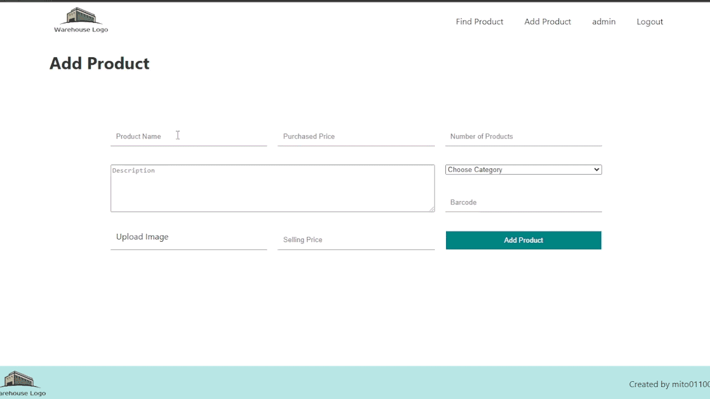
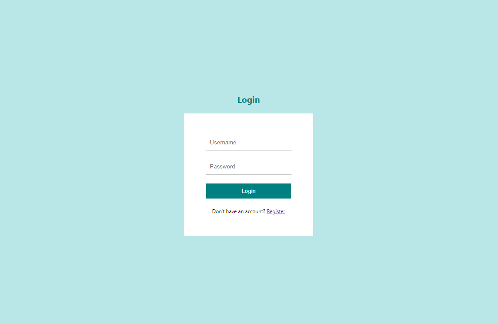
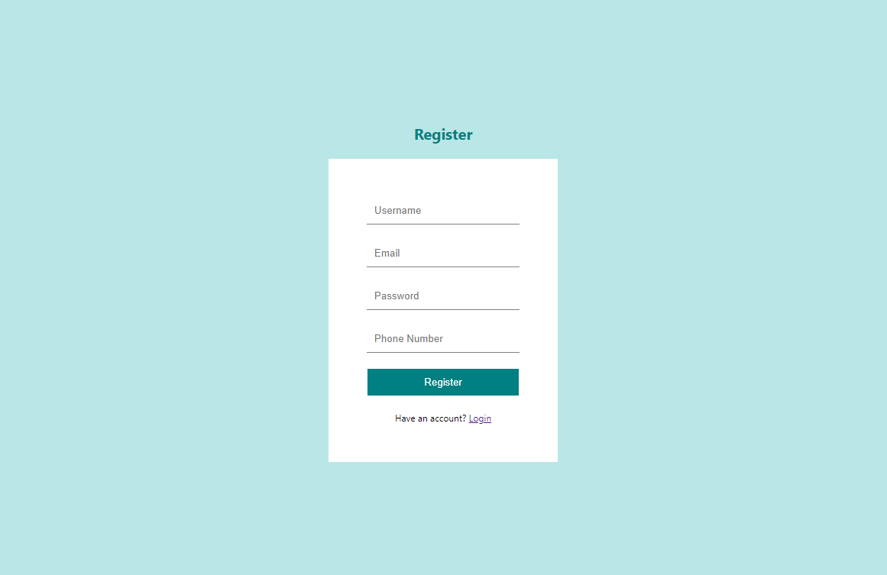
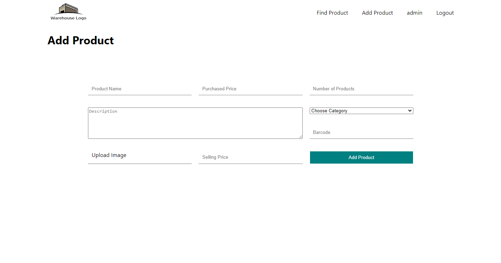
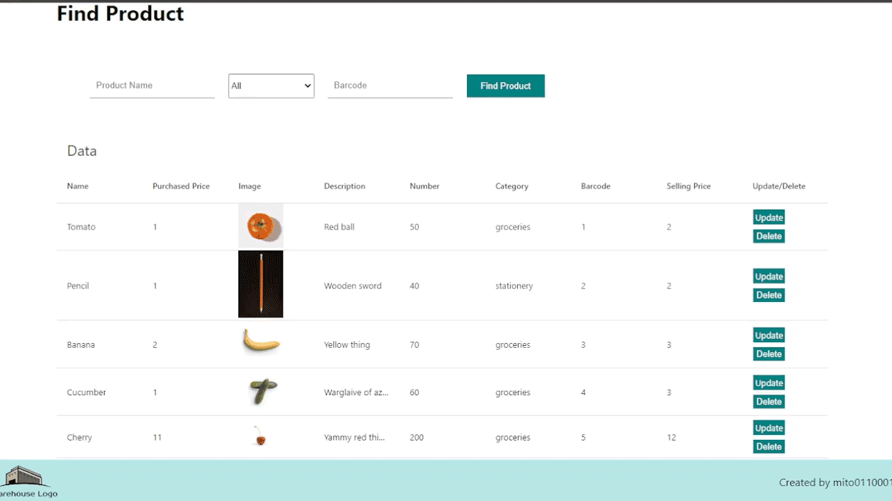
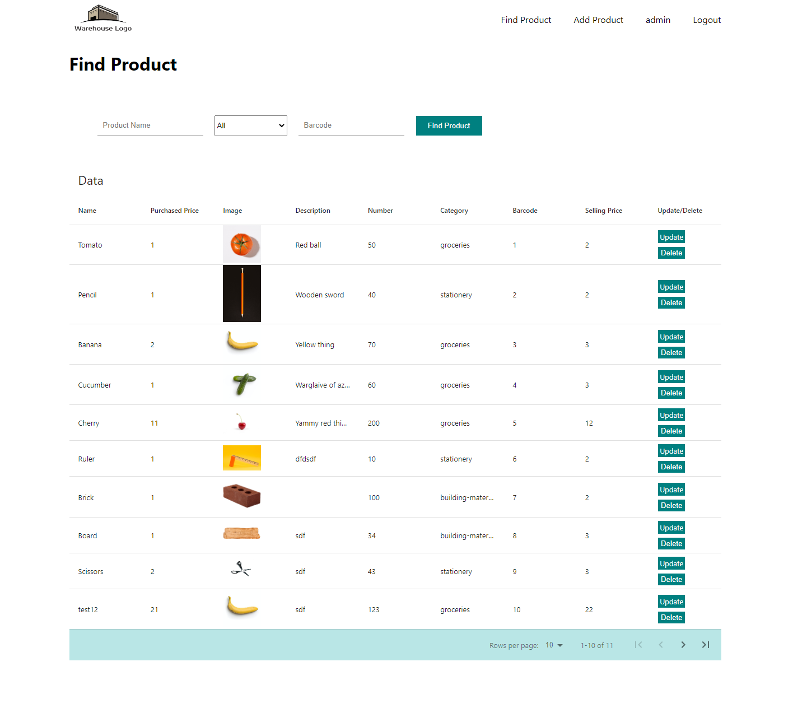

# Warehouse

## :clipboard: About
Full stack web application created with React, NodeJS, express and MySQL 
Intended for managing warehouse products.

## :star2: Features 

#### Create account and login using your local database.
> Authentication with [JWT](https://www.npmjs.com/package/jsonwebtoken) and [Cookie](https://www.npmjs.com/package/cookie-parser)  
> Password encryption with [bcrypt](https://www.npmjs.com/package/bcrypt)

     

#### Add and Update product in DB.
> Uploading files with [multer](https://www.npmjs.com/package/multer)  
> File extension restriction to jpeg, jpg, and png

     

#### Filter and search for product
> Choose category and search by name or find product using unique barcode.

  

